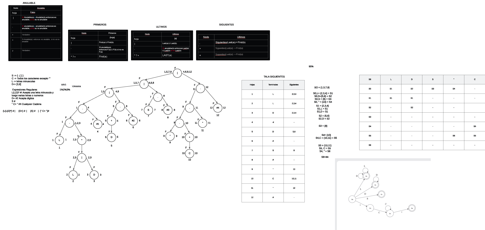

# Manual de Tecnico
**UNIVERSIDAD DE SAN CARLOS DE GUATEMALA**  
**FACULTAD DE INGENIERÍA**     
**CATEDRÁTICO:** ING. ZULMA AGUIRRE   
**TUTOR  ACADÉMICO:** JONATAN LEONEL GARCIA ARANA  
**Nombre:** Brandon Antonio Marroquín Pérez  
**Carnet:** 202300813  
**Fecha de Entrega:** 19 de septiembre de 2024  
**Curso:** LABORATORIO LENGUAJES FORMALES Y DE PROGRAMACION Sección B-
**Semestre:** Cuarto Semestre  

---

# Introducción

Este Manual Técnico describe el desarrollo de una aplicación para la visualización y análisis de localizaciones geográficas y saturación de mercado utilizando Python y Fortran. El objetivo principal de esta aplicación es proporcionar una solución eficiente para que una empresa internacional pueda identificar las mejores ubicaciones para abrir nuevas oficinas, basándose en datos de competencia y saturación de mercado.

El sistema permite la carga y procesamiento de archivos con extensión `.ORG`, los cuales contienen información sobre las posibles localizaciones. A través de la manipulación de estructuras de datos y el uso de algoritmos en Fortran, los datos son analizados para ofrecer una representación gráfica clara en una interfaz desarrollada en Python utilizando Tkinter. La combinación de estas tecnologías garantiza un análisis rápido y preciso, facilitando la toma de decisiones estratégicas para la expansión empresarial.

---

# Objetivos

## 1. General

1.1. Desarrollar una aplicación en Python y Fortran que permita la visualización y análisis de localizaciones geográficas y la saturación del mercado, utilizando archivos con extensión `.ORG`, para facilitar la toma de decisiones estratégicas en una empresa internacional.

## 2. Específicos

2.1.  Implementar funciones en Fortran que analicen la información de los archivos `.ORG`, extrayendo y procesando datos sobre ubicaciones geográficas y la saturación del mercado de manera eficiente.

2.2.  Desarrollar una interfaz gráfica en Python utilizando Tkinter que permita cargar archivos `.ORG`, editar su contenido y generar representaciones gráficas de los datos procesados, proporcionando una visualización clara y detallada de las posibles ubicaciones.

----

# Alcances del Sistema

La aplicación para la visualización y análisis de localizaciones geográficas y saturación de mercado, desarrollada en Python y Fortran, está diseñada para ayudar a una empresa internacional en la toma de decisiones estratégicas sobre la apertura de nuevas oficinas. El sistema permite la carga, edición y procesamiento de archivos con extensión `.ORG`, los cuales contienen información sobre ubicaciones y niveles de saturación del mercado en diferentes regiones.

Este sistema abarca el análisis eficiente de los datos de localización mediante algoritmos implementados en Fortran, proporcionando resultados precisos que son representados gráficamente en una interfaz gráfica desarrollada en Python utilizando Tkinter. La aplicación soporta tanto la carga manual como automática de los archivos, y permite la visualización dinámica de los gráficos generados en función de los datos procesados. 

El manual técnico proporciona instrucciones detalladas para la instalación, configuración y operación del sistema, asegurando su correcta implementación y facilitando su uso por parte de usuarios encargados de la toma de decisiones estratégicas en la empresa.

# Especificación Técnica

## Requisitos de Hardware
- **Sistema operativo**:
  - Windows 10 o superior
  - macOS 10.14 o superior
  - Ubuntu 18.04 o superior
- **Procesador**:
  - Intel Core i5 o superior
  - AMD Ryzen 5 o superior
- **Memoria RAM**:
  - 12 GB o superior
- **Almacenamiento**:
  - 5 GB de espacio libre en disco
- **Tarjeta gráfica**:
  - Intel HD Graphics 620 o superior
  - AMD Radeon R5 o superior
- **Pantalla**:
  - Resolución de 1280 x 720 o superior

## Requisitos de Software
- **Software esencial**:
  - Visual Studio Code: Es el entorno de desarrollo integrado (IDE) utilizado para escribir, depurar y ejecutar el código Fortran.
  - Última versión de Fortran: Es el compilador necesario para compilar y ejecutar el código Fortran.
  - Git (opcional para control de versiones): Es un sistema de control de versiones que permite realizar un seguimiento de los cambios en el código fuente y colaborar con otros desarrolladores.

# Descripción de la Solución

El primer paso en el desarrollo del programa fue crear la interfaz gráfica en Python utilizando la biblioteca Tkinter. Esta interfaz permite al usuario cargar archivos con extensión `.ORG`, visualizar y editar su contenido, y realizar acciones como generar gráficos de localizaciones geográficas y niveles de saturación de mercado. La interfaz fue diseñada para ser intuitiva y facilitar la interacción con los datos, permitiendo una navegación eficiente y una clara visualización de las opciones disponibles.

Una vez completada la interfaz gráfica, se procedió a implementar el analizador en Fortran. Este módulo se encarga de procesar los archivos `.ORG`, extrayendo la información sobre ubicaciones y niveles de saturación del mercado, y estructurando los datos para su análisis. El analizador es capaz de interpretar los datos de manera eficiente, garantizando que la información sea precisa y esté lista para su posterior representación gráfica.

Finalmente, se desarrolló la funcionalidad de generación de gráficos a partir de los datos procesados. Los gráficos permiten visualizar de manera clara las ubicaciones propuestas y los niveles de saturación del mercado, facilitando la toma de decisiones estratégicas. Además, se añadió la opción de exportar reportes con los resultados del análisis, consolidando la información de manera accesible para los usuarios.

# LÓGICA DEL PROGRAMA
### LFP-2S24Proyectos_202300813

# Análisis del Código: Fortran y Python

## 1. Análisis del Código en Fortran

### **Variables Globales**

- **`num_paises`**
  - **Tipo:** `integer`
  - **Descripción:** Número total de países listados en la entrada.

- **`num_continentes`**
  - **Tipo:** `integer`
  - **Descripción:** Número total de continentes listados en la entrada.

- **`paises`**
  - **Tipo:** `character(len=20), dimension(:)`
  - **Descripción:** Lista de nombres de países y continentes leídos de la entrada.

- **`continentes`**
  - **Tipo:** `character(len=20), dimension(:)`
  - **Descripción:** Lista de nombres de continentes extraídos de los datos de entrada.

- **`saturacion`**
  - **Tipo:** `character(len=20), dimension(:)`
  - **Descripción:** Lista de valores de saturación asociados con cada país, incluyendo el símbolo de porcentaje.

- **`poblacion`**
  - **Tipo:** `character(len=20), dimension(:)`
  - **Descripción:** Lista de poblaciones correspondientes a cada país.

- **`bandera`**
  - **Tipo:** `character(len=20), dimension(:)`
  - **Descripción:** Lista de banderas asociadas a cada país.

### **Variables Locales en Subrutinas**

- **`suma_saturacion`**
  - **Tipo:** `real(kind=8)`
  - **Descripción:** Acumulador para la suma de saturación de un continente específico.

- **`promedio_saturacion`**
  - **Tipo:** `real(kind=8)`
  - **Descripción:** Promedio de saturación calculado para un continente.

- **`promedio_menor`**
  - **Tipo:** `real(kind=8)`
  - **Descripción:** Promedio de saturación más bajo encontrado entre todos los continentes.

- **`C_string`**
  - **Tipo:** `character(len=7)`
  - **Descripción:** Código de color hexadecimal para nodos en el gráfico DOT, usado para representar la saturación.

- **`j`, `k`, `i`**
  - **Tipo:** `integer`
  - **Descripción:** Contadores y índices utilizados en bucles para iterar a través de listas y datos.

- **`contador_continente`**
  - **Tipo:** `integer`
  - **Descripción:** Contador para registrar el número de continentes procesados.

- **`contador_promedio_cantidad`**
  - **Tipo:** `integer`
  - **Descripción:** Contador para registrar la cantidad de promedios de saturación calculados.

- **`contador_promedio_continente`**
  - **Tipo:** `integer`
  - **Descripción:** Contador para registrar el número de promedios de saturación por continente.

- **`posicion_menor`**
  - **Tipo:** `integer`
  - **Descripción:** Índice del continente con el promedio de saturación más bajo.

- **`posicion_menor_paiscompleto`**
  - **Tipo:** `integer`
  - **Descripción:** Índice del país con el menor porcentaje de saturación en la lista completa.

- **`real_saturacion`**
  - **Tipo:** `real(kind=8)`
  - **Descripción:** Valor de saturación convertido a tipo numérico real, sin el símbolo de porcentaje.

- **`saturacion_sin_porcentaje`**
  - **Tipo:** `character(len=20)`
  - **Descripción:** Valor de saturación sin el símbolo de porcentaje para convertir a número real.

- **`pais_menor_porc`**
  - **Tipo:** `character(len=20)`
  - **Descripción:** Nombre del país con el menor porcentaje de saturación.

- **`pMnombre`**
  - **Tipo:** `character(len=20)`
  - **Descripción:** Nombre del continente con el menor promedio de saturación.

- **`poblacion_grafica`**
  - **Tipo:** `character(len=20)`
  - **Descripción:** Población del país con el menor porcentaje de saturación para visualización gráfica.

- **`bandera_grafica`**
  - **Tipo:** `character(len=20)`
  - **Descripción:** Bandera del país con el menor porcentaje de saturación para visualización gráfica.

- **`j_string`, `i_string`, `Contador_continente_string`**
  - **Tipo:** `character(len=20)`
  - **Descripción:** Cadenas utilizadas para generar identificadores de nodos en el archivo DOT.

### **Lógica del Código en Fortran**

1. **Procesamiento de Datos**:
   - El código procesa una lista de países y continentes, identificando los continentes y calculando la saturación promedio de los países que pertenecen a cada continente.
   - Se recorre la lista de países y, cuando se encuentra un continente, se suman las saturaciones de los países que siguen hasta encontrar el siguiente continente. La saturación se convierte a un valor real y se acumula.

2. **Cálculo de Saturación Promedio**:
   - Para cada continente, se calcula el promedio de saturación dividiendo la suma total de saturación entre el número de países procesados.
   - El color del continente se determina en función del promedio de saturación, con diferentes colores representando diferentes rangos de saturación.

3. **Generación del Archivo DOT**:
   - Se generan nodos para cada continente y país en el archivo DOT, utilizando colores específicos para representar el nivel de saturación.
   - Se establecen enlaces entre los nodos de continentes y países para crear una representación gráfica completa de los datos.

4. **Determinación de Resultados**:
   - El continente con el promedio de saturación más bajo se identifica y se registra, así como el país con el menor porcentaje de saturación dentro de ese continente.

## 2. Análisis del Código en Python (Tkinter)

### **Variables Globales**

- **`archivo_entrada`**
  - **Tipo:** `str`
  - **Descripción:** Ruta del archivo de entrada cargado por el usuario.

- **`archivo_salida`**
  - **Tipo:** `str`
  - **Descripción:** Ruta del archivo de salida donde se guarda el contenido procesado.

- **`texto_salida`**
  - **Tipo:** `str`
  - **Descripción:** Texto que se muestra en la interfaz gráfica después de procesar el archivo.

### **Variables Locales en Funciones y Métodos**

- **`file_content`**
  - **Tipo:** `str`
  - **Descripción:** Contenido del archivo de entrada leído y procesado.

- **`parsed_data`**
  - **Tipo:** `dict`
  - **Descripción:** Datos estructurados extraídos del archivo XML, utilizados para la generación de gráficos.

- **`graph_data`**
  - **Tipo:** `dict`
  - **Descripción:** Datos formateados para la generación del gráfico en Graphviz.

- **`path`**
  - **Tipo:** `str`
  - **Descripción:** Ruta del archivo que se abre o guarda, especificada por el usuario.

### **Lógica General del Código en Python**

1. **Carga de Archivos**:
   - La interfaz gráfica permite al usuario seleccionar un archivo XML para analizar. El archivo se lee y su contenido se almacena en `file_content`.

2. **Procesamiento de Datos**:
   - El contenido del archivo XML se analiza y se convierte en una estructura de datos adecuada (diccionario o similar) usando `parsed_data`.

3. **Generación de Gráficos**:
   - Los datos procesados se formatean en `graph_data` para ser utilizados en la generación de gráficos con Graphviz. La información se visualiza en la interfaz gráfica.

4. **Visualización de Resultados**:
   - Los resultados del procesamiento y la generación de gráficos se muestran en la interfaz gráfica, actualizando el `texto_salida` para reflejar el estado del análisis y los gráficos generados.

5. **Guardar Resultados**:
   - La interfaz gráfica permite al usuario guardar el resultado procesado en un archivo de salida, especificado por el usuario.

Este análisis detalla cómo cada parte del código contribuye a la funcionalidad global del programa, tanto en Fortran como en Python.

# Acontinuación la logica del analizador de una manera más clara
