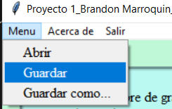
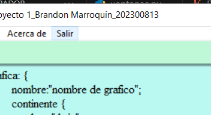

# Manual de Usuario
**UNIVERSIDAD DE SAN CARLOS DE GUATEMALA**     
**FACULTAD DE INGENIERÍA**     
**CATEDRÁTICO:** ING. ZULMA AGUIRRE         
**TUTOR  ACADÉMICO:** JONATAN LEONEL GARCIA ARANA      
**Nombre:** Brandon Antonio Marroquín Pérez  
**Carnet:** 202300813  
**Fecha de Entrega:** 19 de septiembre de 2024  
**Curso:** LABORATORIO LENGUAJES FORMALES Y DE PROGRAMACION Sección B-
**Semestre:** Cuarto Semestre  

---

# Objetivos del Proyecto

## Objetivo General
Desarrollar una interfaz interactiva que permita visualizar de manera gráfica las ubicaciones propuestas para la apertura de una nueva oficina en función de su saturación de mercado, utilizando archivos con extensión `.ORG` para el análisis de datos y combinando una interfaz gráfica en Python con un motor de procesamiento en Fortran.

---
## Objetivos Específicos
- Implementar una interfaz gráfica en Python utilizando la biblioteca Tkinter, que permita la carga y visualización de archivos `.ORG`, así como la representación gráfica de los datos procesados.
- Desarrollar funciones en Fortran que realicen el análisis de los datos de ubicación y saturación de mercado desde los archivos `.ORG`, proporcionando información precisa para generar los gráficos en la interfaz.

---

# Introducción

Este manual de usuario está diseñado para guiarte en el uso de una aplicación desarrollada en Python y Fortran, cuyo objetivo es ayudar a una empresa internacional a encontrar la ubicación ideal para abrir una nueva oficina con menor competencia en el mercado. La aplicación utiliza un archivo con extensión `.ORG` que contiene información clave sobre las localizaciones propuestas, su ubicación geográfica y un porcentaje que indica la saturación del mercado en cada lugar.

La interfaz gráfica, desarrollada en Python utilizando la biblioteca Tkinter, permite al usuario cargar archivos `.ORG`, visualizar los datos directamente en un editor de texto o generarlos desde cero, y luego ver la representación gráfica de las ubicaciones. Por otro lado, el análisis de los datos y la manipulación de los archivos se realiza en Fortran, garantizando un procesamiento eficiente y preciso de la información sobre saturación de mercado y ubicaciones geográficas.

A lo largo de este manual, se explicará detalladamente cómo utilizar cada función de la aplicación, desde la carga y edición de archivos `.ORG`, hasta la generación y visualización de los gráficos basados en los datos analizados. Esta herramienta está diseñada para ofrecer una solución integral, fácil de usar, y adaptada a las necesidades de la empresa, maximizando la eficiencia en la toma de decisiones estratégicas.

---

# Información del Sistema

El sistema fue desarrollado utilizando una combinación de lenguajes de programación: Python y Fortran. La interfaz gráfica fue implementada en Python utilizando la biblioteca Tkinter, mientras que el análisis de datos y el procesamiento de archivos fue llevado a cabo en Fortran, empleando Visual Studio Code con la última versión de Fortran. 

Se adoptó una metodología de programación estructurada para procesar los archivos con extensión `.ORG`, los cuales contienen información sobre ubicaciones geográficas y la saturación de mercado. A través del análisis en Fortran, los datos son manipulados para identificar las mejores localizaciones posibles para una nueva oficina. El sistema permite visualizar estos datos de manera gráfica dentro de la interfaz, proporcionando una representación clara de las áreas de interés. Las estructuras de datos y algoritmos implementados permiten manejar eficientemente la información extraída de los archivos, garantizando un análisis rápido y preciso.

---

# Requisitos del Sistema

Para ejecutar correctamente el programa, es necesario contar con una computadora con Windows 10 o 11, ya que estos sistemas operativos proporcionan el rendimiento adecuado para manejar aplicaciones de análisis de datos y visualización gráfica. Además, se requiere tener instalado Visual Studio Code, preferiblemente en su última versión, para asegurar la compatibilidad con los lenguajes utilizados en el desarrollo, Python y Fortran.

Es indispensable contar con la última versión de Python, así como la instalación de la biblioteca Tkinter para la interfaz gráfica. Asimismo, se recomienda tener la versión más reciente de Fortran instalada, para asegurar el correcto procesamiento de los archivos `.ORG` y evitar posibles incompatibilidades durante el análisis de datos. Para garantizar un óptimo desempeño, se sugiere un equipo con al menos 8 GB de memoria RAM y una resolución de pantalla adecuada para visualizar los gráficos generados por la aplicación.

---

# FLUJO DE LAS FUNCIONALIDADES DEL SISTEMA
1. Primero guardamos los cambios en el archivo.f90 y luego ejecutamos el archivo.py para que se visualizen los datos en la interfaz gráfica.

2. Vamos en la esquina superior izquirda de la ventana y abrimos el archivo `.ORG` 

3. Cargamos el archivo `.ORG` y visualizamos los datos en la interfaz gráfica

4. Apachamos en el boton que dice analisis y veremos como se crea un archivo.dot ademas de que las partes de la población y pais seleccionado se llenaron, la poblacion significa la cantidad de habitantes que tiene el pais con menor porcentaje de saturación y teniendo un continente con promedio bajo siendo el menor de todos, ademas "pais seleccionado" signifca el pais que tiene estos caracteres "el nombre", ademas de que veremos en la parte de abajo en la esquina inferior derecha la bandera del pais seleccionado

5. Apachamos ahora el boton "Mostrar grafica" y aparecera en el lado del label de la derecha un esquema que contendra los datos del texto de la izquirda, pero estos datos en un esquema con colores y porcentajes

6. dejando de lado esa parte que ya se mostro tenemos esta parte donde en la parte superior izquierda de la ventana aparece en el menu mas opciones aparte de abrir, aparece la opción de guardar y guardar como

7. Ahora si vemos a su derecha podemos ver la pestaña que dice "acerca de" al presionarlonos saldra una ventana con la informacion de la persona creadora del programa (en este caso con mis datos)

8. Ahora si vemos a su derecha podemos ver la pestaña que dice "salir" al presionarlonos se cerrara el programa en su totalidad

