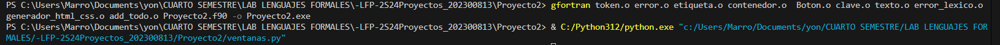
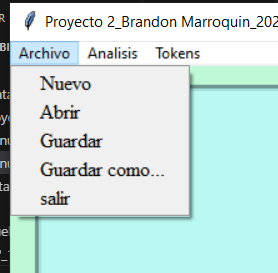
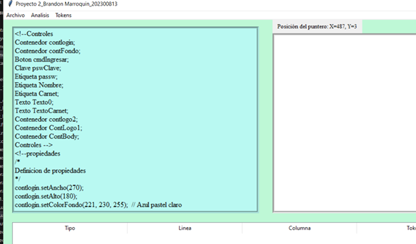
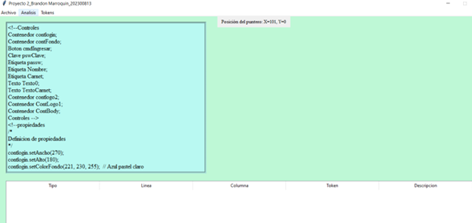
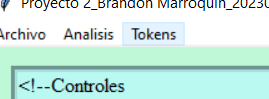
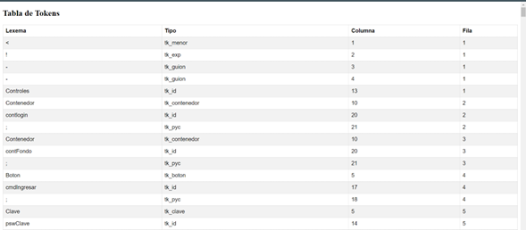
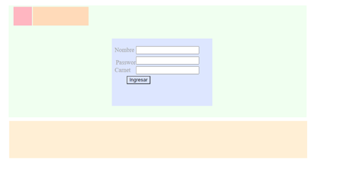
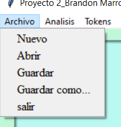

# Manual de Usuario
**UNIVERSIDAD DE SAN CARLOS DE GUATEMALA**     
**FACULTAD DE INGENIERÍA**     
**CATEDRÁTICO:** ING. ZULMA AGUIRRE         
**TUTOR  ACADÉMICO:** JONATAN LEONEL GARCIA ARANA      
**Nombre:** Brandon Antonio Marroquín Pérez  
**Carnet:** 202300813  
**Fecha de Entrega:** 19 de septiembre de 2024  
**Curso:** LABORATORIO LENGUAJES FORMALES Y DE PROGRAMACION Sección B-
**Semestre:** Cuarto Semestre  

---

# Objetivos del Proyecto

## Objetivo General
Desarrollar una interfaz gráfica en Python que permita al usuario cargar y analizar archivos .LFP, procesar tokens y visualizar información relevante de manera interactiva. El sistema permitirá analizar los datos en función de criterios específicos, utilizando una combinación de procesamiento en Python y herramientas adicionales para representar visualmente los resultados en la interfaz.

---
## Objetivos Específicos
- Implementar un sistema de análisis de tokens desde archivos .ORG que permita cargar, procesar, y analizar los datos, extrayendo la información clave para mostrarla de forma estructurada en la interfaz gráfica, permitiendo al usuario interactuar con los resultados de manera eficiente.

- Desarrollar una interfaz gráfica en Python utilizando Tkinter que facilite la navegación por las opciones de análisis y visualización de datos, con menús interactivos para la carga de archivos, opciones de análisis, y la presentación de resultados de manera clara y ordenada, sin afectar el tamaño o disposición de la ventana principal.

---

# Introducción

Este manual de usuario está diseñado para guiarte en el uso de una aplicación desarrollada en Python y Fortran, cuyo objetivo es procesar y analizar archivos con extensión .LFP, que contienen tokens y datos estructurados para su posterior análisis. La aplicación permite cargar estos archivos, analizar los tokens contenidos en ellos, y visualizar los resultados de manera gráfica e interactiva.

La interfaz gráfica, desarrollada en Python utilizando la biblioteca Tkinter, facilita al usuario la carga de archivos .LFP, permitiendo visualizar su contenido, realizar ediciones, y generar informes basados en el análisis de los tokens. El procesamiento de los datos se realiza en Fortran, garantizando un análisis rápido y eficiente de los tokens, asegurando la precisión en la interpretación de la información.

A lo largo de este manual, se explicará detalladamente cómo utilizar cada función de la aplicación, desde la carga y edición de los archivos .LFP, hasta la generación de análisis detallados y su representación gráfica. Esta herramienta está diseñada para ofrecer una solución intuitiva, fácil de usar, y eficiente, optimizando el manejo de archivos .LFP y mejorando la experiencia del usuario en el procesamiento y análisis de datos complejos.

---

# Información del Sistema

El sistema fue desarrollado utilizando una combinación de lenguajes de programación: Python y Fortran. La interfaz gráfica fue implementada en Python utilizando la biblioteca Tkinter, mientras que el análisis de datos y la generación de archivos HTML fue llevado a cabo en Fortran, empleando Visual Studio Code con la última versión de Fortran.

Se adoptó una metodología de programación estructurada para procesar los archivos con extensión .LFP, que contienen información sobre la configuración de un formulario de inicio de sesión. A través del análisis en Fortran, los datos son manipulados para construir etiquetas y campos de entrada que se visualizan en un formato HTML. El sistema permite visualizar estos datos de manera clara en la interfaz, proporcionando una representación ordenada de los elementos del formulario.

Las estructuras de datos y algoritmos implementados en Fortran permiten manejar eficientemente la información extraída de los archivos, garantizando una generación rápida y precisa del código HTML y CSS correspondiente. La integración de estos componentes asegura que los usuarios puedan interactuar fácilmente con el formulario de inicio de sesión y acceder a las funcionalidades del sistema.

---

# Requisitos del Sistema

Para ejecutar correctamente el programa, es necesario contar con una computadora con Windows 10 o 11, ya que estos sistemas operativos proporcionan el rendimiento adecuado para manejar aplicaciones de análisis de datos y visualización gráfica. Además, se requiere tener instalado Visual Studio Code, preferiblemente en su última versión, para asegurar la compatibilidad con los lenguajes utilizados en el desarrollo, Python y Fortran.

Es indispensable contar con la última versión de Python, así como la instalación de la biblioteca Tkinter para la interfaz gráfica. Asimismo, se recomienda tener la versión más reciente de Fortran instalada, para asegurar el correcto procesamiento de los archivos `.LFP` y evitar posibles incompatibilidades durante el análisis de datos. Para garantizar un óptimo desempeño, se sugiere un equipo con al menos 8 GB de memoria RAM y una resolución de pantalla adecuada para visualizar los gráficos generados por la aplicación.

---

# FLUJO DE LAS FUNCIONALIDADES DEL SISTEMA
1. Primero hay que ejecutar los siguientes comandos en la terminal de visual studio code

2. Vamos en la esquina superior izquirda de la ventana y abrimos el archivo `.LFP` 

3. Cargamos el archivo `.LFP` y visualizamos los datos en la interfaz gráfica, cabe recalcar que a la derecha de la visualizacion de los datos se encontrara un label donde se mostrara la posicion del puntero

4. Ahora en las pestañas podemos ver una opcion que dice analizar, la cual nos permitira analisar el archivo `.LFP`, ademas de eso si el archivo esta todo correcto veremos que en la parte de abajo no se muestran errores, si llegara a pasar que haya un error entonces se mostraran en la parte de abajo

5. Ahora de nuevo en las pestañas podemos ver una opcion que dice "Tokens", la cual nos permitira ver la tabla que guardo(adjunto tabla de tokens)

6. Ahora esto generada un html el cual sera el siguiente

7. Ahora si luego de ver todo eso vamos a ver la pestaña de archivo, la cual no solo nos permite Abrir un archivo tambien nos permite  hacer lo siguiente:

- Nuevo: limpia el lugar de datos y nos pregunta si queremos guardar el archivo, esto en caso de que se nos haya olvidado de guardarlo o si queremos sobreescribirlo

- Abrir: nos permite abrir un archivo

- Guardar: nos permite guardar el archivo

- Guardar como...: nos permite guardar el archivo con un nuevo nombre

- Salir: cierra la ventana y termina la ejecucion del programa

